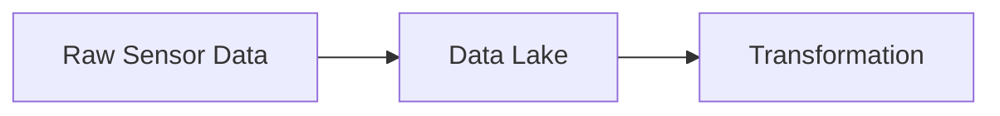

## ETL vs ELT: Understanding the Difference and Which to Choose

In the world of data engineering, one of the key processes that define how data is handled is the distinction between ETL (Extract, Transform, Load) and ELT (Extract, Load, Transform). Both approaches involve getting data from one or more sources and preparing it for analysis, but the order in which the steps are carried out is crucial.

In this post, we'll explore the differences, the evolution of these approaches, and when to use one over the other.

---

## What is ETL?

ETL stands for:

1. **Extract**: Data is extracted from the source systems (e.g., databases, APIs).
2. **Transform**: The extracted data is transformed to meet the needs of the target system, such as cleaning, aggregating, and enriching the data.
3. **Load**: The transformed data is then loaded into the target database, usually a Data Warehouse.

This traditional process was widely adopted when on-premises data warehouses were common, and computational power was limited.

---

## What is ELT?

ELT stands for:

1. **Extract**: Data is extracted from the source systems.
2. **Load**: The raw data is immediately loaded into a Data Lake or Cloud Data Warehouse.
3. **Transform**: Data is transformed inside the target system, usually by leveraging the power of cloud computing or distributed systems.

This process has become more popular with the rise of cloud-native systems like Google BigQuery and Amazon Redshift, where storage and compute are separated, and transformations can happen after data is loaded.

---

## Key Differences Between ETL and ELT

### Order of Operations

- **ETL** transforms data before loading it into the target system.
- **ELT** loads raw data first and then performs transformations within the data warehouse or lake.

### Performance

- **ELT** benefits from the scalability of cloud services. In ELT, transformations can happen in parallel using distributed computing power, which leads to faster performance for large datasets compared to traditional ETL.

### Flexibility

- With **ELT**, raw data is always available, meaning data engineers or analysts can apply new transformations as needed without going back to the source.
- **ETL** requires re-extraction or reprocessing for any changes to transformations.

### Cost

- **ETL** can be more cost-effective if compute resources are limited, as data is pre-processed before storage.
- **ELT** can incur additional storage costs since raw data and transformed data are both stored, but it leverages cheaper cloud storage options.

---

## When to Choose ETL?

- If you're dealing with sensitive data or compliance regulations that require cleaning and masking data before storage.
- When you're working with on-premises infrastructure that doesn't have the scalability to transform data after loading.

---

## When to Choose ELT?

- When you're using cloud-native systems like Google BigQuery, Snowflake, or Redshift, where transformation can leverage cloud computing power.
- If you need flexibility to transform data for multiple use cases after loading.
- When working with big data or streaming data, **ELT** provides the performance and scalability needed.

---

## Why Has ELT Gained Popularity?

The growth of cloud computing has led to a shift from **ETL** to **ELT** because:

- **Scalability**: Cloud systems can handle larger volumes of data and scale horizontally.
- **Separation of storage and compute**: Cloud-native solutions separate storage and computation, allowing businesses to store raw data at low cost and process it on-demand.
- **Real-time Analytics**: Modern ELT pipelines can handle streaming data, enabling real-time insights.

---

## Conclusion

Both ETL and ELT have their use cases, and understanding the differences can help you choose the right approach for your data strategy. The shift towards cloud platforms has made ELT a preferred choice for many organizations due to its flexibility, scalability, and performance benefits.

---

### What's your data architecture like? Drop a comment below!
