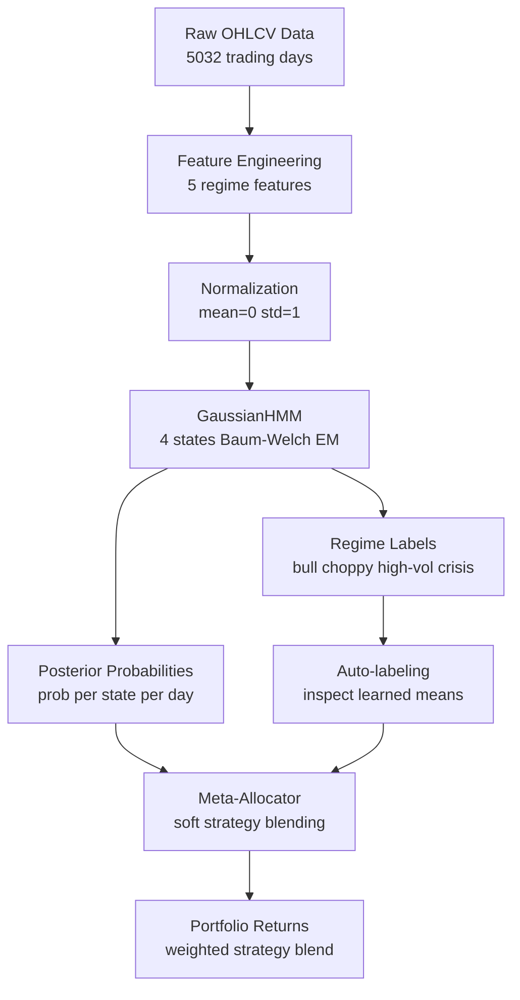

## RegimeSense: Building an Adaptive Market Regime Detection System

Most trading strategies are built with a single market environment in mind. Momentum strategies thrive when markets trend. Mean reversion strategies work when prices oscillate. Defensive strategies shine during crises. The problem is that markets don't stay in one state — they cycle through dramatically different conditions, and a strategy optimized for one regime will often fail badly in another.

RegimeSense is my attempt to solve this problem the way professional systematic funds do: by explicitly detecting which market regime is active and continuously adapting strategy allocations in response. This post walks through the core ideas, the architecture, and the key decisions that shaped the system.

---

## The Core Idea: Markets Have Memory

Before getting into code, it's worth understanding why regime detection is a meaningful problem at all.

Consider two periods in S&P 500 history: 2017 and 2022. In 2017, realized volatility averaged around 7% annualized, daily returns had mild positive autocorrelation, and the rolling Sharpe ratio stayed above 2.0 for most of the year. In 2022, realized volatility spiked above 25%, returns had negative autocorrelation (sharp moves followed by reversals), and the rolling Sharpe was deeply negative. These are not just different market environments — they are structurally different regimes that reward entirely different strategies.

The key insight is that regimes are **persistent**. Markets don't randomly jump between states every day. A bull market tends to stay a bull market. A crisis tends to stay a crisis, at least for weeks. This temporal stickiness is exactly what makes regime detection tractable — and it's why a Hidden Markov Model is the right tool for the job.

---

## Why Hidden Markov Models?

A Hidden Markov Model is built for exactly this problem. The regime is "hidden" — you can't directly observe whether the market is in a bull or crisis state. What you can observe are measurable features: volatility, autocorrelation, Sharpe ratio, skewness, volume patterns. The HMM works backwards from what it can see to infer what it can't.

More importantly, the HMM explicitly models **transition probabilities** — the likelihood of moving from one regime to another. A well-fitted HMM on market data will learn that the bull state has a ~97% self-transition probability, meaning once you're in a bull market you tend to stay there for an average of ~33 trading days before switching. This is fundamentally different from clustering approaches like k-means, which classify each day independently with no memory of what came before.

The other critical output is the **posterior probability distribution** — for every day, the HMM gives you not just "today is regime 2" but "today is 75% bull, 20% choppy, 5% crisis." This uncertainty quantification is what enables soft allocation: rather than hard-switching strategies when a regime changes, you blend them proportionally to the HMM's confidence.

---

## Feature Engineering: What to Feed the Model

The HMM needs features that collectively fingerprint each regime. I settled on five, each capturing a distinct dimension of market behavior:

**Realized Volatility** — rolling 20-day annualized standard deviation of log returns. The primary separator between calm and stressed regimes. Low volatility characterizes bull and choppy markets; high volatility characterizes trending and crisis conditions.

**Return Autocorrelation** — lag-5 autocorrelation over a 40-day rolling window. Positive autocorrelation means returns tend to continue (momentum, trending). Negative autocorrelation means returns tend to reverse (mean-reverting, choppy). This is the key feature that separates trending from mean-reverting regimes at similar volatility levels.

**Rolling Sharpe Ratio** — 60-day risk-adjusted return. Captures the _quality_ of recent price movement, not just direction or magnitude. A high rolling Sharpe in a low-vol environment signals a genuine bull market. A near-zero rolling Sharpe in low-vol signals a choppy, going-nowhere market.

**Return Skewness** — 60-day skewness of the return distribution. This is the crisis early warning signal. Skewness turns sharply negative in the weeks leading into major drawdowns — the distribution develops a fat left tail as large negative days accumulate. In late 2007 and early 2020, skewness turned negative months before the worst drawdowns materialized.

**Volume Momentum** — 5-day average volume divided by 20-day average volume. Conviction behind price moves. A trend accompanied by above-average volume is real institutional participation. A trend on below-average volume is likely to reverse. Volume momentum distinguishes genuine trending regimes from noise.

The correlation matrix across these five features shows no pair exceeding 0.7 — they're genuinely complementary dimensions, not redundant measurements of the same thing.

---

## Training the Model

The HMM is trained on 5,032 trading days of SPY data from 2005 to 2024, using `hmmlearn`'s `GaussianHMM` with `covariance_type="full"`. The full covariance specification means each regime gets its own complete covariance matrix — it can learn that in the crisis regime, volatility and Sharpe ratio are strongly anti-correlated (when vol spikes, Sharpe collapses). The diagonal approximation would miss this.

All features are normalized to mean 0 and standard deviation 1 before training. Without normalization, a feature with larger raw scale (like rolling Sharpe, which ranges from -4 to +4) would dominate the Gaussian likelihood computation over a feature with smaller scale (like volume momentum, which ranges from 0.5 to 2.0). Normalization ensures each feature contributes proportionally to regime classification.

The model is fitted using the Baum-Welch algorithm (a variant of Expectation-Maximization), which iterates between estimating regime assignments given current parameters, and updating parameters given those assignments, until convergence.

After fitting, the model numbers states 0 through 3 arbitrarily. I auto-label them by inspecting the learned mean vectors: the state with highest volatility and most negative Sharpe is crisis; the state with lowest volatility and highest Sharpe is bull; the remaining two are split by autocorrelation sign.



The learned regime map from the trained model:

| Regime         | Realized Vol          | Rolling Sharpe             | % of Days |
| -------------- | --------------------- | -------------------------- | --------- |
| Bull           | -0.584 (low)          | +1.143 (high)              | 25.5%     |
| Choppy         | +0.190 (moderate)     | +0.093 (near zero)         | 24.0%     |
| High-vol trend | -0.443 (low-moderate) | -0.174 (slightly negative) | 31.2%     |
| Crisis         | +1.265 (very high)    | -1.370 (very negative)     | 19.3%     |

The transition matrix diagonal confirms the stickiness property: bull 0.975, choppy 0.966, crisis 0.978, high-vol trend 0.969. Each regime has at least a 96.6% probability of persisting to the next day.

---

## The Strategy Pool

Four strategies, each designed for a specific regime condition:

**Momentum** — 12-1 month time-series momentum. Buy when the past 12-month return minus the past 1-month return (the reversal exclusion) is positive. The 1-month exclusion is standard — short-term return tends to reverse due to liquidity effects and market maker inventory rebalancing. Goes long or flat, no shorting.

**Mean Reversion** — RSI-14 based. Long when RSI drops below 35 (oversold), short when RSI exceeds 65 (overbought). Uses exponential weighted moving average for the RSI calculation, which is the standard implementation. Effective in choppy regimes where prices oscillate around a mean; dangerous in trending regimes where you buy falling knives.

**Trend Following** — 50/200-day moving average crossover. Long when the 50-day MA is above the 200-day MA, flat otherwise. Slower and more robust than momentum — the 200-day MA is difficult to fake with short-term noise. Generates fewer signals and fewer false positives than pure momentum.

**Defensive** — Dual danger detector. Goes to cash when either (a) current realized volatility exceeds 1.5x the 1-year baseline volatility, or (b) price is more than 8% below its 60-day high. Uses the 1-year baseline rather than a short rolling average for the volatility comparison — this prevents the detector from normalizing to crisis-level volatility and failing to trigger during sustained crises.

All strategies implement a shared base class that enforces a `signal.shift(1)` on the generated signal before computing returns. This is the single most important implementation detail — today's signal is generated from today's data but can only be acted on at tomorrow's open. Without the shift, the backtest implicitly trades on the same close price used to generate the signal, which is lookahead bias.

---

## The Meta-Allocator

The allocator computes strategy weights as a dot product of the regime posterior probability vector with a pre-defined affinity matrix:

```
weight_i = (regime_probs · affinity_i) / Σ weights
```

The affinity matrix encodes how well each strategy performs in each regime:

|                 | Bull | Choppy | Hi-vol | Crisis |
| --------------- | ---- | ------ | ------ | ------ |
| Momentum        | 0.8  | 0.1    | 0.6    | 0.1    |
| Mean reversion  | 0.3  | 0.9    | 0.1    | 0.1    |
| Trend following | 0.6  | 0.1    | 0.8    | 0.2    |
| Defensive       | 0.1  | 0.2    | 0.3    | 0.9    |

On a typical bull day where regime probabilities are [bull=0.75, choppy=0.20, crisis=0.05, high-vol=0.00], the raw momentum weight is 0.75×0.8 + 0.20×0.1 + 0.05×0.1 = 0.625. After normalizing across all four strategies, momentum receives about 38% of the allocation. The system never makes a hard switch — it transitions smoothly as the HMM's posterior probabilities shift.

This matters for two reasons. First, regime boundaries are uncertain. A hard switch on the day the model crosses a classification threshold is fragile — small changes in the features can cause large position swings. Soft allocation using posteriors naturally dampens this sensitivity. Second, transaction costs compound on frequent large rebalances. Smooth transitions generate smaller position changes and lower realized costs.

---

## Backtest Results

The backtest uses a strict walk-forward split: HMM trained on 2005–2020, validated on 2021–2022, final performance reported on 2023–2024 only. Every number below comes from data the model never saw during development.

Transaction costs are modeled at 10 basis points per rebalance, applied on weekly allocation changes exceeding 2% of portfolio value.

| Strategy         | OOS Sharpe | Ann. Return | Max Drawdown |
| ---------------- | ---------- | ----------- | ------------ |
| Momentum         | 0.641      | 9.3%        | -33.7%       |
| Mean reversion   | 0.435      | 5.4%        | -28.5%       |
| Trend following  | 0.733      | 9.8%        | -33.7%       |
| Defensive        | 0.596      | 7.4%        | -12.1%       |
| **RegimeSense**  | **0.769**  | **7.1%**    | **-25.6%**   |
| SPY buy-and-hold | ~0.65      | ~12%        | -24.5%       |

The portfolio Sharpe of 0.769 beats every individual strategy. Max drawdown of -25.6% is meaningfully better than any trend-following strategy. The lower raw return vs SPY is expected — the system trades less aggressively than buy-and-hold, which is the tradeoff for the reduced drawdown profile.

The rolling 60-day Sharpe chart tells an important story: the system doesn't have a uniformly high Sharpe at all times. It has periods of strong risk-adjusted returns during well-defined regimes and periods of near-zero Sharpe during regime transitions. This is honest behavior — a regime-switching system should struggle at transition points where the HMM is uncertain. The fact that the system recovers cleanly after transitions rather than blowing up is the real validation.

---

## Live Deployment

The system runs as a weekly paper trading loop on Alpaca. Every Friday at 3:50 PM ET, it:

1. Pulls the most recent 300 days of SPY data from the Alpaca data API
2. Computes the five regime features on live data
3. Loads the trained HMM and classifies the current regime
4. Computes target strategy weights via the meta-allocator
5. Maps weights to three ETF proxies: QQQ (momentum + trend), SPY (mean reversion), BIL (defensive/cash)
6. Submits market orders for positions deviating more than 2% from target
7. Logs regime label, posterior probabilities, strategy weights, ETF targets, and portfolio value to a CSV

The 2% rebalance threshold deserves explanation. If the target weight for QQQ is 52% and the current position is 53%, the system doesn't trade. The round-trip transaction cost of that 1% adjustment would exceed any benefit from precision rebalancing. Only meaningful deviations trigger orders.

The HMM is loaded from a trained checkpoint rather than retrained on live data. Retraining on 300 days of recent data would produce an unstable model that overfits to recent conditions. The value of training on 20 years of history is that the model learned the long-run statistical properties of market regimes — including regimes it hasn't seen recently. Stability is deliberate.

The live log CSV is the most underrated artifact of the deployment. After 8–12 weeks of weekly entries, it becomes a live validation dataset. Computing the IC between the regime posterior probabilities and the subsequent 5-day SPY return gives an honest, out-of-sample measure of whether the regime detection is adding predictive value — a standard no backtest can fully substitute for.

---

## What I Would Do Differently

**More features, more carefully selected.** The five features work well but leave clear signal on the table. Credit spreads (HYG vs LQD) and the VIX term structure (VIX3M/VIX ratio) would add genuine orthogonal information about risk appetite and market stress that price and volume data alone can't capture.

**Calibrate the affinity matrix from data.** The current affinity values are informed starting points based on financial theory. Computing the per-regime Sharpe ratio for each strategy and deriving the affinity matrix from those empirical values would make the allocation more rigorous and less judgmental.

**Expand the universe.** Running the same regime detection on multiple assets simultaneously — not just SPY — would provide a richer picture of where different regimes are active. Regime detection on equities, bonds, and commodities combined is how macro funds like Bridgewater actually think about it.

**Turnover constraints.** The current allocator doesn't penalize large week-over-week allocation changes beyond the 2% threshold. Adding an explicit turnover penalty to the allocation optimization would reduce transaction costs further and smooth regime transitions.

---

## Key Takeaways

Building this system reinforced a few things that are easy to read about but harder to internalize until you implement them:

The shift(1) discipline is not optional. Every time I've seen a backtest that looks too good, there's a missing shift somewhere. Check it first.

Regime persistence is what makes this tractable. If regimes lasted one day, no model could detect them reliably. The fact that markets stay in a condition for weeks is the structural feature that makes the problem solvable.

Posterior probabilities are more valuable than point estimates. Knowing the model is 75% confident in a bull regime is fundamentally more useful than knowing it classified today as bull. The uncertainty is real information.

OOS validation is the only number that matters. In-sample Sharpe is a measure of how well you fit your training data. OOS Sharpe is a measure of whether your hypothesis about market structure is correct.

---

_RegimeSense is live paper trading on Alpaca. The full codebase is on [GitHub](https://github.com/moh1tt/RegimeSense)._
